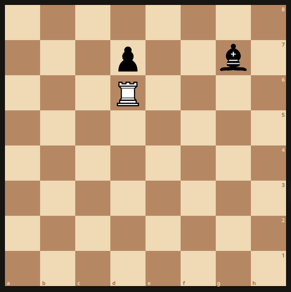

# Rules for Bluff Chess
## Controls
  - Move real piece: left click (hold) + left click (release)
  - Move bluff piece: left click (hold) + left click (release)
  - Bluff move: right click (hold) + right click (release)

## Movement Rules
  - Pieces move in the same direction as in regular chess.
  - Enemy pieces are not considered for inputting a valid move, i.e., if a move input is valid on an empty chess board, then it's valid in bluff chess. 
  - Three choices for moves per turn:
    - Move a regular piece
    - Move a bluff piece
    - Bluff move
  - A bluff move creates a bluffed piece that is binded with the real piece.

## Examples for Basic Rules
### Valid Move Input

In this example, clicking the rook on d1 and moving it to d8 would be a valid move input. This does not mean that the rook will end up on d8 after the move. However, the move will go through and where the rook ends up will depend on which pawns being real/buffed. 

### Making a Bluff Move 
<table><tr>
<td>  </td>
<td>  </td>
</tr></table>
In this example, we start off
the game by bluffing the move e4. Now, the bluffed pawn on e4 is binded with the real pawn on e2. Black cannot see the real piece on e2 and instead sees the bluff piece on e4. 

## Capturing/Collision Rules
  - When a bluff piece gets captured then the bluff piece disappears and the binded real piece is revealed. 
  - Real pieces can capture both bluffed pieces and real pieces.
  - Bluff pieces can only capture other bluff pieces. 
  - A bluff piece does not destroy itself when capturing another bluff piece. 
  - Only real pieces can stop a real piece's movement.

## Examples of Captures
### Multiple Captures 
<table><tr>
<td>  </td>
<td>  </td>
</tr></table>
In this example, we input the move Rd7. Here, the bishop on d4 is a bluff piece binded to the bishop on g7. The pawn on d5 is also a bluff piece, and is binded to the pawn on d7. The rook on d6 is real. Since bluff pieces do not stop real piece movement, the move Rd7 will capture both the bishop on d4 and the pawn on d5, and is finally stopped by the real rook on d7.
<table><tr>
<td>  </td>
<td>  </td>
</tr></table>
Notice that the real pieces are revealed after the bluff pieces are captured. 

## Binding Rules
  - Moving a real piece that is binded to a bluff piece will destroy the binded bluff piece. 
  - Making a bluff move with a real piece that is binded to a bluff piece will create a new bind and destroy the formerly binded bluff piece. 

## Check/Checkmate Rules
 - There are no checks in bluff chess. 
 - Bluff chess is won when a real king is captured.
 - Enemy pieces cannot restrict castling. 

